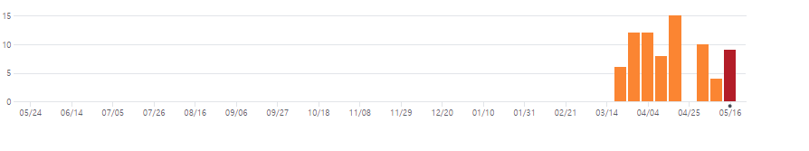
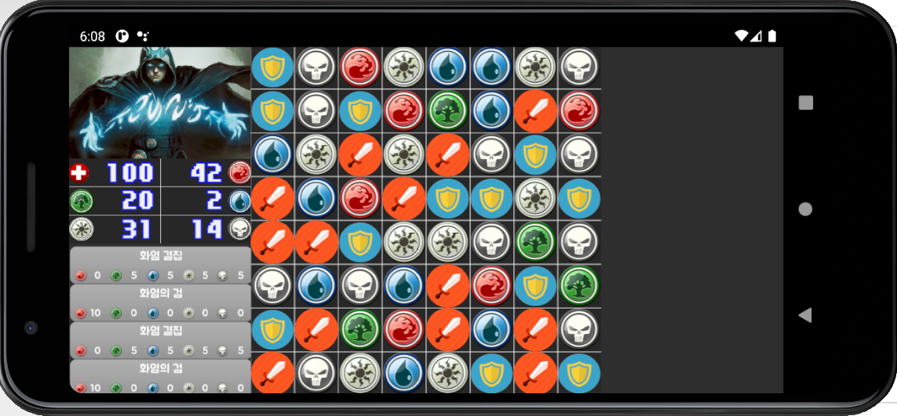

# 스마트폰 게임 프로그래밍

## Term Project 2차 발표

------

게임 소개: 애니팡과 같은 3-매치 퍼즐 게임에  RPG 요소를 더한 게임


------

진행 상황: 

|                         | 진행 정도 |               비고               |
| ----------------------- | :-------: | :------------------------------: |
| 3-매치 게임 기본 베이스 |   100%    |                                  |
| 특수 블럭               |    0%     |            목표 변경             |
| 스킬                    |    50%    | 기본 틀 완성, 컨텐츠 구현만 남음 |
| 적                      |    0%     |                                  |
| 아이템                  |    0%     |                                  |
| 로그라이크 요소         |    0%     |                                  |

------

커밋 상황



| 주차  | 커밋 수 |
| :---: | :-----: |
| 1주차 |    2    |
| 2주차 |    0    |
| 3주차 |    0    |
| 4주차 |    0    |
| 5주차 |    0    |
| 6주차 |    0    |
| 7주차 |    7    |


------

목표 변경

특수 블럭 구현 - 

현재 블럭의 종류가 7종이고 8x8 칸에서 메인 게임이 진행되는데 블럭을 하나만 움직여도 연쇄적으로 블럭이 파괴되어서 특수 블럭은 밸런스상 과해 보이므로 많은 블럭을 한번에 매칭했을 때 다른 방식으로 어드벤티지를 제공하도록 기획 변경

------

MainGame에 등장하는 클래스에 대한 간단한 설명



Board - 8x8의 Block 클래스의 객체를 2차원 배열로 가짐

업데이트가 불릴 때 배열에 저장된 모든 Block 객체들에 대해서 연속된 블럭을 체크하고 3개 이상이면 그것들을 없애고 난 후 빈 공간에 새로운 블럭을 생성하여 채워 넣음

```
if (canMove) {
            // 연속된 블럭 체크
            for (int i = 0; i < 8; i++) {
                for (int j = 0; j < 8; j++) {
                    if (blocks[i][j] != null)
                    {
                        Block.blockType tIndex = blocks[i][j].type;
                        // 가로
                        {
                            int count = 1;
                            while (i + count < 8) {
                                if (blocks[i + count][j].type == tIndex) {
                                    count++;
                                } else {
                                    break;
                                }
                            }
                            if (count >= 3) {
                                for (int k = 0; k < count; k++) {
                                    blocks[i + k][j].boom = true;
                                }
                            }
                        }
                        // 세로
                        {
                            int count = 1;
                            while (j + count < 8) {
                                if (blocks[i][j + count].type == tIndex){
                                    count++;
                                } else {
                                    break;
                                }
                            }
                            if (count >= 3) {
                                for (int k = 0; k < count; k++) {
                                    blocks[i][j + k].boom = true;
                                }
                            }
                        }
                        // 대각선1
                        {
                            int count = 1;
                            while (i + count < 8 && j + count < 8) {
                                if (blocks[i + count][j + count].type == tIndex){
                                    count++;
                                } else {
                                    break;
                                }
                            }
                            if (count >= 3) {
                                for (int k = 0; k < count; k++) {
                                    blocks[i + k][j + k].boom = true;
                                }
                            }
                        }
                        // 대각선2
                        {
                            int count = 1;
                            while (i - count > 0 && j + count < 8) {
                                if (blocks[i - count][j + count].type == tIndex){
                                    count++;
                                } else {
                                    break;
                                }
                            }
                            if (count >= 3) {
                                for (int k = 0; k < count; k++) {
                                    blocks[i - k][j + k].boom = true;
                                }
                            }
                        }
                    }

                }
            }
        }
```

터치 이벤트를 받으면 내부의 Block 객체들과 터치 위치의 충돌을 체크하여서 충돌된 Block 객체를 선택함. 이전에 선택된 객체와 새로 선택된 객체의 거리가 1일 경우 두 블럭의 위치를 바꿈.

```
 if (canMove && myTurn){
            for (int i = 0; i < 8; i++) {
                for (int j = 0; j < 8; j++) {
                    if (CollisionHelper.collides(blocks[i][j], x, y))
                    {
                        if (selected != null)
                        {
                            if (selected == blocks[i][j]) {
                                selected.select(false);
                                selected = null;
                            }
                            else if (Math.abs(i - selectX) <= 1 && Math.abs(j - selectY) <= 1) {
                                selected.select(false);
                                swap(selected, blocks[i][j]);
                                Block temp = selected;
                                blocks[selectX][selectY] = blocks[i][j];
                                blocks[i][j] = temp;
                                selected = null;
                                canMove = false;
                            }
                            else
                            {
                                selected.select(false);
                                selected = blocks[i][j];
                                blocks[i][j].select(true);
                                selectX = i;
                                selectY = j;
                            }
                        }
                        else
                        {
                            selected = blocks[i][j];
                            blocks[i][j].select(true);
                            selectX = i;
                            selectY = j;
                        }

                        return true;
                    }
                }
            }
        }
```

Block - 블럭 객체는 자신이 어떤 블럭인지에 대한 정보와 해당하는 비트맵을 가짐.

Board에 의해 위치 변경 명령을 받으면 목표 위치에 도착할 때까지 이동함. 이 때, 블럭이 이동중일 경우 Board에 자신이 이동중이라는 것을 알려서 그 사이에 플레이어가 조작을 하지 못하도록 막음.

```
		float dx = (Math.abs(tx - x) + SPEED) * game.frameTime;
        float dy = (Math.abs(ty - y) + SPEED) * game.frameTime;
        // 위치 스왑
        if (tx == x && ty == y) {
            isMoving = false;
        }
        if (tx != x)
        {
            if (tx <= x) {
                dx = -dx;
            }
            x += dx;
            if ((dx > 0 && x > tx) || (dx < 0 && x < tx)) {
                x = tx;
            }
        }
        if (ty != y)
        {
            if (ty <= y) {
                dy = -dy;
            }
            y += dy;
            if ((dy > 0 && y > ty) || (dy < 0 && y < ty)) {
                y = ty;
            }
        }
```

Player - 플레이어는 자신의 상태를 나타내줄 UIManager 객체와 자신의 자원 정보를 가짐.

Board에서 Block이 제거될 때 Player는 해당 Block에 해당되는 자원을 얻음.


UIManager - 플레이어의 정보를 화면에 나타낼 UI들을 관리

Player에게서 정보를 읽어 와서 Update가 불릴 때 정보를 갱신함.

터치 이벤트를 받을 때, SkillUI일 경우에 해당 슬롯의 index를 체크하여 해당하는 스킬을 사용함.

```
 switch (skillIndex) {
            case 0:
                if (game.player.useMana(0,5,5,5,5))
                {
                    for (int i = 0; i < 8; i++) {
                        for (int j = 0; j < 8; j++) {
                            if (game.board.blocks[i][j] != null) {
                                if (game.board.blocks[i][j].type == Block.blockType.Blue || game.board.blocks[i][j].type == Block.blockType.Green)
                                {
                                    game.board.blocks[i][j].change(Block.blockType.Red);
                                }
                            }
                        }
                    }
                }

                break;
            case 1:
                if (game.player.useMana(10,0,0,0,0))
                {
                    for (int i = 0; i < 8; i++) {
                        for (int j = 0; j < 8; j++) {
                            if (game.board.blocks[i][j] != null) {
                                if (game.board.blocks[i][j].type == Block.blockType.Red)
                                {
                                    game.board.blocks[i][j].change(Block.blockType.Sword);
                                }
                            }
                        }
                    }
                }
                break;
        }
```

